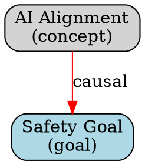

# World Model Visualizer Documentation

## Overview

The World Model Visualizer provides inspection and visual traversal of Axiom's current semantic world model, including entities, beliefs, causal relationships, inferred values, contradictions, and uncertainties. The system supports both human-readable summaries and structured outputs for frontend visualization, serving as an internal cartography system for Axiom's mind.

## Table of Contents

- [Core Concepts](#core-concepts)
- [Architecture](#architecture) 
- [API Reference](#api-reference)
- [Integration Guide](#integration-guide)
- [Usage Examples](#usage-examples)
- [Entity Types and Relations](#entity-types-and-relations)
- [Query Interface](#query-interface)
- [Export Formats](#export-formats)
- [Temporal Analysis](#temporal-analysis)
- [Simulated Worldmap States](#simulated-worldmap-states)
- [Best Practices](#best-practices)
- [Troubleshooting](#troubleshooting)

## Core Concepts

### Entity-Centric World Model

The visualizer treats Axiom's world understanding as a graph of entities with rich metadata:

```python
# Example entity with full metadata
EntityNode(
    entity_id="ai_alignment",
    entity_type=EntityType.CONCEPT,
    primary_name="AI Alignment",
    aliases=["AI Safety", "Alignment Problem"],
    confidence_score=0.85,
    tags={"important", "research_area", "safety_critical"},
    attributes=[
        EntityAttribute(
            name="research_status",
            value="active",
            confidence=0.9,
            source="planning_memory",
            timestamp=datetime.now(timezone.utc)
        )
    ],
    associated_beliefs=[uuid4()],
    contradictions=[...],
    relations=[...]
)
```

### Belief Clusters

Related beliefs are automatically grouped into clusters based on shared topics and entity relationships:

```python
BeliefCluster(
    cluster_id="cluster_ai_safety",
    belief_ids=[belief1_id, belief2_id, belief3_id],
    central_topic="safety",
    coherence_score=0.75,
    entities_involved=["ai_alignment", "safety_goal", "research_area"]
)
```

### Causal Chains

The system automatically detects and maps causal relationships between entities:

```python
CausalChain(
    chain_id="chain_research_to_safety",
    links=[
        ("research_effort", "knowledge_gain", 0.8),
        ("knowledge_gain", "safety_improvement", 0.7)
    ],
    description="Research leads to safety improvements",
    strength=0.75,
    is_feedback_loop=False
)
```

## Architecture

### Core Components

```
WorldModelVisualizer
├── Entity Extraction
│   ├── BeliefRegistry Integration
│   ├── PlanningMemory Integration  
│   ├── SelfModeling Integration
│   └── Journaling Integration
├── Graph Construction
│   ├── Belief Clustering
│   ├── Causal Chain Detection
│   └── Contradiction Analysis
├── Query Interface
│   ├── Filtered Search
│   ├── Complex Queries
│   └── Result Ranking
└── Export System
    ├── JSON Export
    ├── Graphviz Export
    └── API Endpoints
```

### Data Flow

```
Subsystems → Entity Extraction → Graph Construction → Query/Export
    ↓              ↓                    ↓               ↓
Beliefs        Entities           World Model      Visualizations
Goals          Attributes         Graph            JSON/DOT
Actions        Relations          Clusters         API Responses
Meta-beliefs   Contradictions     Chains           Interactive Views
```

## API Reference

### Core Classes

#### WorldModelVisualizer

Main class for world model visualization and querying.

```python
class WorldModelVisualizer:
    def __init__(self, data_dir: str = "/workspace/data/world_model")
    
    # Graph Generation
    def generate_world_model_graph(self, force_refresh: bool = False) -> WorldModelGraph
    
    # Entity Extraction
    def extract_entities_from_beliefs(self) -> Dict[str, EntityNode]
    def extract_entities_from_planning(self) -> Dict[str, EntityNode]
    def extract_entities_from_self_model(self) -> Dict[str, EntityNode]
    
    # Querying
    def query_entities(self, filter_params: QueryFilter) -> List[EntityNode]
    def get_entity_summary(self, entity_id: str) -> Optional[Dict[str, Any]]
    def get_contradiction_overlay(self) -> Dict[str, Any]
    
    # Analysis
    def build_belief_clusters(self, entities: Dict[str, EntityNode]) -> Dict[str, BeliefCluster]
    def extract_causal_chains(self, entities: Dict[str, EntityNode]) -> Dict[str, CausalChain]
    def detect_contradictions(self, entities: Dict[str, EntityNode]) -> None
    
    # Export
    def export_to_json(self, output_file: str = None) -> Dict[str, Any]
    def export_to_graphviz(self, output_file: str = None) -> str
```

#### QueryFilter

Filter parameters for entity search and retrieval.

```python
@dataclass
class QueryFilter:
    entity_name_pattern: Optional[str] = None
    entity_types: Optional[List[EntityType]] = None
    belief_ids: Optional[List[UUID]] = None
    tags: Optional[List[str]] = None
    confidence_threshold: Optional[float] = None
    relation_types: Optional[List[RelationType]] = None
    has_contradictions: Optional[bool] = None
    updated_since: Optional[datetime] = None
    updated_before: Optional[datetime] = None
```

### Convenience Functions

```python
# Quick creation and common operations
def create_world_model_visualizer(data_dir: str = "/workspace/data/world_model") -> WorldModelVisualizer

def quick_entity_search(query: str, visualizer: WorldModelVisualizer = None) -> List[EntityNode]

def get_contradictory_entities(visualizer: WorldModelVisualizer = None) -> List[EntityNode]

def export_world_model_summary(output_file: str, visualizer: WorldModelVisualizer = None) -> None
```

## Integration Guide

### With Belief Registry

The visualizer automatically extracts entities from beliefs in the registry:

```python
visualizer = WorldModelVisualizer()

# Automatically connects to belief registry if available
entities = visualizer.extract_entities_from_beliefs()

# Entities include belief metadata and associations
for entity in entities.values():
    print(f"Entity: {entity.primary_name}")
    print(f"Associated beliefs: {len(entity.associated_beliefs)}")
    print(f"Confidence: {entity.confidence_score:.2f}")
```

### With Planning Memory

Goals and actions become entities with causal relationships:

```python
# Planning entities are automatically extracted
planning_entities = visualizer.extract_entities_from_planning()

# Goals become GOAL type entities
# Actions become ACTION type entities with causal links to goals
goal_entities = [e for e in planning_entities.values() if e.entity_type == EntityType.GOAL]
action_entities = [e for e in planning_entities.values() if e.entity_type == EntityType.ACTION]
```

### With Self-Modeling Engine

Meta-beliefs and self-state become introspective entities:

```python
# Self-model entities represent internal state
self_entities = visualizer.extract_entities_from_self_model()

# Includes current system state and meta-beliefs
if "self_state" in self_entities:
    self_state = self_entities["self_state"]
    health_attrs = self_state.get_attributes_by_name("system_health")
    print(f"System health: {health_attrs[0].value}")
```

### Graceful Degradation

The system works even when subsystems are unavailable:

```python
# Will work with whatever subsystems are available
visualizer = WorldModelVisualizer()
graph = visualizer.generate_world_model_graph()

# Check what's available in metadata
print(f"Belief registry available: {graph.metadata['belief_registry_available']}")
print(f"Planning memory available: {graph.metadata['planning_memory_available']}")
print(f"Total entities: {graph.metadata['total_entities']}")
```

## Usage Examples

### Basic World Model Generation

```python
from world_model_visualizer import create_world_model_visualizer

# Create visualizer and generate world model
visualizer = create_world_model_visualizer()
graph = visualizer.generate_world_model_graph()

print(f"World model contains:")
print(f"  • {len(graph.entities)} entities")
print(f"  • {len(graph.belief_clusters)} belief clusters")
print(f"  • {len(graph.causal_chains)} causal chains")

# Show entity breakdown by type
entity_types = {}
for entity in graph.entities.values():
    entity_type = entity.entity_type.value
    entity_types[entity_type] = entity_types.get(entity_type, 0) + 1

for entity_type, count in entity_types.items():
    print(f"  • {count} {entity_type} entities")
```

### Querying Entities

```python
from world_model_visualizer import QueryFilter, EntityType

# Search for AI-related concepts
ai_filter = QueryFilter(entity_name_pattern="ai")
ai_entities = visualizer.query_entities(ai_filter)

print(f"Found {len(ai_entities)} AI-related entities:")
for entity in ai_entities[:5]:
    print(f"  • {entity.primary_name} (confidence: {entity.confidence_score:.2f})")

# Find high-confidence goals
goal_filter = QueryFilter(
    entity_types=[EntityType.GOAL],
    confidence_threshold=0.7
)
high_conf_goals = visualizer.query_entities(goal_filter)

# Find entities with contradictions
contradictory_filter = QueryFilter(has_contradictions=True)
contradictory_entities = visualizer.query_entities(contradictory_filter)

print(f"Found {len(contradictory_entities)} entities with contradictions")
```

### Complex Query Example

```python
# Find volatile, high-impact entities that need attention
volatile_filter = QueryFilter(
    tags=["volatile", "important"],
    confidence_threshold=0.5,
    has_contradictions=True
)

volatile_entities = visualizer.query_entities(volatile_filter)

for entity in volatile_entities:
    print(f"\nEntity: {entity.primary_name}")
    print(f"  Confidence: {entity.confidence_score:.2f}")
    print(f"  Tags: {', '.join(entity.tags)}")
    print(f"  Contradictions: {len(entity.contradictions)}")
    
    # Show contradiction details
    for contradiction in entity.contradictions:
        print(f"    • {contradiction.explanation}")
        for suggestion in contradiction.resolution_suggestions:
            print(f"      → {suggestion}")
```

### Entity Relationship Analysis

```python
# Analyze entity relationships
entity_id = "ai_alignment"
entity = graph.entities.get(entity_id)

if entity:
    print(f"Analyzing entity: {entity.primary_name}")
    
    # Show causal relationships
    causal_relations = entity.get_relations_by_type(RelationType.CAUSAL)
    print(f"Causal relationships: {len(causal_relations)}")
    
    for relation in causal_relations:
        target = graph.entities.get(relation.target_entity_id)
        if target:
            print(f"  • Causes: {target.primary_name} (confidence: {relation.confidence:.2f})")
    
    # Show semantic relationships
    semantic_relations = entity.get_relations_by_type(RelationType.SEMANTIC)
    print(f"Semantic relationships: {len(semantic_relations)}")
    
    # Show attributes
    print(f"Attributes: {len(entity.attributes)}")
    for attr in entity.attributes:
        print(f"  • {attr.name}: {attr.value} (from {attr.source})")
```

### Contradiction Analysis

```python
# Get comprehensive contradiction overlay
contradiction_overlay = visualizer.get_contradiction_overlay()

print(f"Contradiction Analysis:")
print(f"  Total contradictions: {contradiction_overlay['total_contradictions']}")
print(f"  Entities affected: {contradiction_overlay['entities_with_contradictions']}")

# Show detailed contradiction information
for contradiction in contradiction_overlay['contradictions']:
    print(f"\nEntity: {contradiction['entity_name']}")
    print(f"  Explanation: {contradiction['explanation']}")
    print(f"  Confidence: {contradiction['confidence']:.2f}")
    print(f"  Conflicting beliefs: {len(contradiction['conflicting_beliefs'])}")
    
    print("  Resolution suggestions:")
    for suggestion in contradiction['resolution_suggestions']:
        print(f"    • {suggestion}")
```

### Export and Visualization

```python
# Export to JSON for frontend consumption
json_data = visualizer.export_to_json("world_model.json")

# Export to Graphviz for network visualization
dot_content = visualizer.export_to_graphviz("world_model.dot")

# Generate PNG from DOT (requires Graphviz)
import subprocess
subprocess.run(["dot", "-Tpng", "world_model.dot", "-o", "world_model.png"])

# Export using convenience function
from world_model_visualizer import export_world_model_summary
export_world_model_summary("summary.json")  # Automatically detects format
```

## Entity Types and Relations

### Entity Types

| Type | Description | Source | Examples |
|------|-------------|---------|----------|
| `CONCEPT` | Abstract ideas and concepts | Beliefs, general extraction | "AI Alignment", "Democracy" |
| `PERSON` | Individual people | Text analysis, references | "Eliezer Yudkowsky", "Ada Lovelace" |
| `OBJECT` | Physical or digital objects | Contextual extraction | "GPT-4", "The Internet" |
| `EVENT` | Temporal events or occurrences | Planning, journaling | "Research Conference", "System Update" |
| `GOAL` | Planned objectives | Planning Memory | "Improve AI Safety", "Complete Research" |
| `ACTION` | Planned or completed actions | Planning Memory | "Write Paper", "Run Experiment" |
| `BELIEF` | Explicit belief statements | Belief Registry | "AI is beneficial", "Climate change is real" |
| `VALUE` | Values and preferences | Future: Value Inference Engine | "Truthfulness", "Human welfare" |

### Relation Types

| Type | Description | Examples |
|------|-------------|----------|
| `CAUSAL` | Causal influence relationships | Action → Goal, Research → Knowledge |
| `TEMPORAL` | Time-based relationships | Before/after, sequence |
| `HIERARCHICAL` | Parent/child, part/whole | Goal → Subgoal, Category → Instance |
| `EMOTIONAL` | Emotional associations | Fear, excitement, concern |
| `CONTRADICTORY` | Conflicting relationships | Opposing beliefs, incompatible goals |
| `SUPPORTIVE` | Mutually reinforcing | Supporting evidence, aligned goals |
| `SEMANTIC` | Meaning-based similarity | Related concepts, synonyms |
| `REFERENCE` | Explicit references | Citations, mentions |

## Query Interface

### Filter Capabilities

The query system supports sophisticated filtering:

```python
# Multiple criteria can be combined
complex_filter = QueryFilter(
    entity_name_pattern="safety",           # Name contains "safety"
    entity_types=[EntityType.CONCEPT, EntityType.GOAL],  # Only concepts and goals
    tags=["important"],                     # Must have "important" tag
    confidence_threshold=0.6,               # Confidence >= 0.6
    relation_types=[RelationType.CAUSAL],   # Has causal relationships
    has_contradictions=False,               # No contradictions
    updated_since=datetime.now() - timedelta(days=7)  # Updated in last week
)

results = visualizer.query_entities(complex_filter)
```

### Result Ranking

Query results are automatically ranked by confidence score (descending), but you can implement custom ranking:

```python
# Custom ranking by importance and recency
results = visualizer.query_entities(filter_params)

# Sort by combination of confidence and importance tags
def importance_score(entity):
    confidence = entity.confidence_score
    importance_bonus = 0.1 if "important" in entity.tags else 0
    recency_bonus = 0.1 if entity.last_updated > datetime.now() - timedelta(days=1) else 0
    return confidence + importance_bonus + recency_bonus

results.sort(key=importance_score, reverse=True)
```

### Entity Summary Format

Entity summaries provide comprehensive structured data:

```json
{
  "entity_id": "ai_alignment",
  "primary_name": "AI Alignment",
  "entity_type": "concept",
  "aliases": ["AI Safety", "Alignment Problem"],
  "confidence_score": 0.85,
  "last_updated": "2024-01-15T10:30:00Z",
  "tags": ["important", "research_area", "safety_critical"],
  "attributes": [
    {
      "name": "research_status",
      "value": "active",
      "confidence": 0.9,
      "source": "planning_memory",
      "timestamp": "2024-01-15T10:30:00Z",
      "tags": ["current"]
    }
  ],
  "relations": [
    {
      "target_entity_id": "safety_research",
      "relation_type": "semantic",
      "confidence": 0.8,
      "description": "Related research area",
      "source": "belief_registry",
      "timestamp": "2024-01-15T10:30:00Z",
      "bidirectional": true
    }
  ],
  "associated_beliefs": ["uuid1", "uuid2"],
  "contradictions": []
}
```

## Export Formats

### JSON Export

Complete world model data structure suitable for programmatic access:

```python
json_data = visualizer.export_to_json()

# Structure:
{
  "metadata": {
    "generation_timestamp": "2024-01-15T10:30:00Z",
    "total_entities": 150,
    "total_belief_clusters": 25,
    "total_causal_chains": 8,
    "belief_registry_available": true,
    "planning_memory_available": true
  },
  "entities": { ... },
  "belief_clusters": { ... },
  "causal_chains": { ... }
}
```

### Graphviz DOT Export

Network visualization format for rendering with Graphviz:



### API Response Format

For frontend integration, responses follow consistent patterns:

```python
# Entity search API response
{
  "status": "success",
  "query": {
    "entity_name_pattern": "ai",
    "confidence_threshold": 0.7
  },
  "results": {
    "total_count": 15,
    "entities": [...],
    "execution_time_ms": 45
  }
}

# Contradiction overlay API response
{
  "status": "success",
  "summary": {
    "total_contradictions": 5,
    "entities_with_contradictions": 3,
    "high_confidence_contradictions": 2
  },
  "contradictions": [...],
  "generation_timestamp": "2024-01-15T10:30:00Z"
}
```

## Temporal Analysis

### Tracking Entity Evolution

The system tracks how entities change over time:

```python
# Example temporal tracking (future enhancement)
entity_history = visualizer.get_entity_temporal_view("ai_alignment")

for snapshot in entity_history:
    print(f"Time: {snapshot.timestamp}")
    print(f"  Confidence: {snapshot.state['confidence_score']}")
    print(f"  Changes: {', '.join(snapshot.changes_from_previous)}")
    print(f"  Confidence delta: {snapshot.confidence_delta:+.2f}")
```

### Belief Evolution Integration

With journaling integration, track belief changes:

```python
# Track how beliefs about an entity have evolved
if visualizer.journaling:
    # Get recent journal entries mentioning the entity
    recent_mentions = visualizer.journaling.search_entries(
        query="ai alignment",
        days_back=30
    )
    
    # Analyze sentiment and confidence trends
    for entry in recent_mentions:
        print(f"Journal entry {entry.timestamp}: {entry.content[:100]}...")
```

## Simulated Worldmap States

### Overview

The simulator module provides a safe, sidecar-style way to model potential future changes to the worldmap. It is useful for:

- **Pre-evaluating strategies**: Test the impact of different approaches before commitment
- **Selecting optimal plans**: Compare multiple scenarios to choose the best path forward
- **Reasoning about cascading effects**: Understand how changes might propagate through the system
- **Strategic planning**: Model complex multi-step plans and their outcomes

The simulation engine never modifies `world_map.json` directly, ensuring complete safety for exploratory analysis.

### Basic Simulation Usage

```python
from worldmap_simulator import simulate_future_worldmap

# Define hypothetical actions to test
actions = [
    "add_goal:axiom:develop_advanced_memory_system",
    "update_confidence:axiom:0.92",
    "add_entity:memory_v2:system:experimental_memory",
    "add_relationship:axiom:memory_v2:develops:Testing advanced memory capabilities"
]

# Run the simulation
result = simulate_future_worldmap(
    actions=actions,
    simulation_context="Evaluating memory system upgrade path",
    return_diff=True
)

# Analyze results
print(f"Simulation Summary: {result['summary']}")
print(f"Success Rate: {result['metadata']['successful_actions']}/{result['metadata']['actions_count']}")
print(f"Duration: {result['metadata']['duration_seconds']:.2f}s")

# Review changes
if 'diff_report' in result:
    print("\nAnticipated Changes:")
    print(result['diff_report'])
```

### Supported Action Types

#### Entity Management
- `add_entity:name:type:role` - Create new entities for testing
- `update_entity:name:field:value` - Modify entity properties
- `update_confidence:entity:value` - Adjust confidence scores

#### Goal Planning
- `add_goal:entity:goal_text` - Add goals to entities
- `remove_goal:entity:goal_text` - Remove existing goals

#### Relationship Modeling
- `add_relationship:source:target:type:description` - Create new relationships

### Integration with Visualization

The simulation results can be integrated with the world model visualizer for enhanced analysis:

```python
from world_model_visualizer import WorldModelVisualizer
from worldmap_simulator import simulate_future_worldmap

# Run simulation
simulation_result = simulate_future_worldmap(actions, "Strategic planning")
simulated_worldmap = simulation_result['simulated_worldmap']

# Visualize the simulated state
visualizer = WorldModelVisualizer()
visualizer.load_from_dict(simulated_worldmap)

# Generate comparison reports
original_entities = visualizer.get_entity_count()
simulated_entities = len(simulated_worldmap) - 1  # Exclude relationships

print(f"Entity count change: {simulated_entities - original_entities}")

# Export simulated graph for analysis
simulated_graph = visualizer.export_networkx_graph()
```

### Diff Analysis Integration

The worldmap diff utility provides detailed change analysis:

```python
from worldmap_diff import generate_worldmap_diff
from verification_engine import load_worldmap

# Load original worldmap
original = load_worldmap()

# Run simulation
result = simulate_future_worldmap(actions, "Testing scenario")
simulated = result['simulated_worldmap']

# Generate detailed diff
diff_report = generate_worldmap_diff(original, simulated)
print(diff_report)
```

### Safety Features

- **Non-Destructive**: All operations work on deep copies
- **Isolated Processing**: No side effects on persistent data
- **Complete Audit Trail**: Every action is logged with success/failure status
- **Error Handling**: Graceful degradation when actions fail
- **Rollback Safety**: Original worldmap remains untouched

### Use Cases

1. **Strategic Planning**: Model complex multi-step initiatives
2. **Goal Optimization**: Test different goal combinations
3. **Risk Assessment**: Identify potential negative outcomes
4. **Resource Planning**: Understand requirements for changes
5. **Decision Support**: Compare alternative approaches
6. **Hypothesis Testing**: Validate theories about system behavior

### Performance Considerations

- Simulations run in memory and are typically fast (< 1 second)
- Complex diff reports may take additional time to generate
- Large worldmaps (>1000 entities) may require more memory
- Batch multiple actions in single simulation for efficiency

## Best Practices

### Performance Optimization

1. **Use Caching**: The system caches generated graphs for 30 minutes by default:

```python
# First call generates and caches
graph1 = visualizer.generate_world_model_graph()

# Subsequent calls use cache (much faster)
graph2 = visualizer.generate_world_model_graph()

# Force refresh when needed
graph3 = visualizer.generate_world_model_graph(force_refresh=True)
```

2. **Filter Early**: Use specific filters to reduce processing:

```python
# Good: Specific filter reduces processing
specific_filter = QueryFilter(
    entity_types=[EntityType.GOAL],
    confidence_threshold=0.8
)

# Less efficient: Broad search then filtering
all_entities = visualizer.query_entities(QueryFilter())
high_conf_goals = [e for e in all_entities if e.entity_type == EntityType.GOAL and e.confidence_score >= 0.8]
```

3. **Batch Operations**: When doing multiple queries, reuse the visualizer:

```python
visualizer = create_world_model_visualizer()

# Multiple queries reuse the same cached graph
results1 = visualizer.query_entities(filter1)
results2 = visualizer.query_entities(filter2)
results3 = visualizer.query_entities(filter3)
```

### Data Quality

1. **Monitor Entity Extraction Quality**:

```python
graph = visualizer.generate_world_model_graph()

# Check for empty or low-quality entities
empty_entities = [e for e in graph.entities.values() if not e.primary_name.strip()]
low_conf_entities = [e for e in graph.entities.values() if e.confidence_score < 0.3]

print(f"Quality check:")
print(f"  Empty entities: {len(empty_entities)}")
print(f"  Low confidence entities: {len(low_conf_entities)}")
```

2. **Validate Relationships**:

```python
# Check for orphaned relationships (targets that don't exist)
for entity in graph.entities.values():
    for relation in entity.relations:
        if relation.target_entity_id not in graph.entities:
            print(f"Orphaned relation: {entity.entity_id} -> {relation.target_entity_id}")
```

### Integration Patterns

1. **Graceful Degradation**:

```python
def safe_entity_extraction(visualizer):
    entities = {}
    
    try:
        belief_entities = visualizer.extract_entities_from_beliefs()
        entities.update(belief_entities)
        print(f"✅ Extracted {len(belief_entities)} belief entities")
    except Exception as e:
        print(f"⚠️ Belief extraction failed: {e}")
    
    try:
        planning_entities = visualizer.extract_entities_from_planning()
        entities.update(planning_entities)
        print(f"✅ Extracted {len(planning_entities)} planning entities")
    except Exception as e:
        print(f"⚠️ Planning extraction failed: {e}")
    
    return entities
```

2. **Incremental Updates**:

```python
# For systems with changing data, implement delta updates
def update_world_model(visualizer, last_update_time):
    # Only process entities updated since last time
    filter_params = QueryFilter(updated_since=last_update_time)
    
    # Force refresh to get latest data
    graph = visualizer.generate_world_model_graph(force_refresh=True)
    
    return graph
```

## Troubleshooting

### Common Issues

#### Empty or Missing Entities

**Problem**: World model contains few or no entities.

**Diagnosis**:
```python
graph = visualizer.generate_world_model_graph()
print(f"Metadata: {graph.metadata}")

# Check subsystem availability
if not graph.metadata.get('belief_registry_available'):
    print("❌ Belief registry not available")
if not graph.metadata.get('planning_memory_available'):
    print("❌ Planning memory not available")
```

**Solutions**:
- Ensure subsystems are properly initialized
- Check data directory permissions
- Verify belief registry has beliefs
- Check planning memory has goals/actions

#### Low-Quality Entity Extraction

**Problem**: Entities have generic names or low confidence.

**Diagnosis**:
```python
# Analyze entity quality
entities = graph.entities.values()
avg_confidence = sum(e.confidence_score for e in entities) / len(entities)
print(f"Average confidence: {avg_confidence:.2f}")

# Check for generic names
generic_entities = [e for e in entities if len(e.primary_name.split()) <= 1]
print(f"Generic entities: {len(generic_entities)}")
```

**Solutions**:
- Improve belief statement quality
- Use more specific goal descriptions
- Add manual entity aliases where needed
- Adjust confidence thresholds in queries

#### Performance Issues

**Problem**: Slow graph generation or queries.

**Diagnosis**:
```python
import time

start_time = time.time()
graph = visualizer.generate_world_model_graph(force_refresh=True)
generation_time = time.time() - start_time

print(f"Graph generation took {generation_time:.2f} seconds")
print(f"Total entities: {len(graph.entities)}")
print(f"Total beliefs: {graph.metadata.get('total_beliefs', 0)}")
```

**Solutions**:
- Use cached graphs when possible
- Implement more specific queries
- Consider data cleanup for large datasets
- Monitor memory usage with large entity sets

#### Contradiction Detection Issues

**Problem**: Too many false positive contradictions.

**Diagnosis**:
```python
overlay = visualizer.get_contradiction_overlay()
high_conf_contradictions = [
    c for c in overlay['contradictions'] 
    if c['confidence'] > 0.8
]

print(f"High confidence contradictions: {len(high_conf_contradictions)}")
for contradiction in high_conf_contradictions:
    print(f"  {contradiction['explanation']}")
```

**Solutions**:
- Adjust contradiction detection thresholds
- Improve belief statement formatting
- Use more sophisticated NLP for contradiction detection
- Manual review and tagging of known non-contradictions

### Debugging Tools

#### Entity Inspection

```python
def debug_entity(visualizer, entity_id):
    """Comprehensive entity debugging information."""
    entity = visualizer.get_entity_summary(entity_id)
    
    if not entity:
        print(f"❌ Entity '{entity_id}' not found")
        return
    
    print(f"🔍 Entity Debug: {entity['primary_name']}")
    print(f"  ID: {entity['entity_id']}")
    print(f"  Type: {entity['entity_type']}")
    print(f"  Confidence: {entity['confidence_score']:.2f}")
    print(f"  Last updated: {entity['last_updated']}")
    print(f"  Tags: {', '.join(entity['tags'])}")
    
    print(f"\n  Attributes ({len(entity['attributes'])}):")
    for attr in entity['attributes']:
        print(f"    • {attr['name']}: {attr['value']} (from {attr['source']})")
    
    print(f"\n  Relations ({len(entity['relations'])}):")
    for rel in entity['relations']:
        print(f"    • {rel['relation_type']} → {rel['target_entity_id']} ({rel['confidence']:.2f})")
    
    print(f"\n  Beliefs ({len(entity['associated_beliefs'])}):")
    for belief_id in entity['associated_beliefs']:
        print(f"    • {belief_id}")
    
    if entity['contradictions']:
        print(f"\n  ⚠️ Contradictions ({len(entity['contradictions'])}):")
        for contr in entity['contradictions']:
            print(f"    • {contr['explanation']}")
```

#### System Health Check

```python
def system_health_check(visualizer):
    """Comprehensive system health assessment."""
    graph = visualizer.generate_world_model_graph()
    
    print("🏥 World Model Health Check")
    print("=" * 40)
    
    # Basic statistics
    print(f"📊 Statistics:")
    print(f"  Entities: {len(graph.entities)}")
    print(f"  Belief clusters: {len(graph.belief_clusters)}")
    print(f"  Causal chains: {len(graph.causal_chains)}")
    
    # Subsystem availability
    print(f"\n🔌 Subsystem Availability:")
    metadata = graph.metadata
    print(f"  Belief Registry: {'✅' if metadata.get('belief_registry_available') else '❌'}")
    print(f"  Planning Memory: {'✅' if metadata.get('planning_memory_available') else '❌'}")
    print(f"  Self Modeling: {'✅' if metadata.get('self_modeling_available') else '❌'}")
    print(f"  Journaling: {'✅' if metadata.get('journaling_available') else '❌'}")
    
    # Entity quality metrics
    entities = list(graph.entities.values())
    if entities:
        avg_confidence = sum(e.confidence_score for e in entities) / len(entities)
        entities_with_relations = len([e for e in entities if e.relations])
        entities_with_contradictions = len([e for e in entities if e.contradictions])
        
        print(f"\n📈 Quality Metrics:")
        print(f"  Average confidence: {avg_confidence:.2f}")
        print(f"  Entities with relations: {entities_with_relations} ({entities_with_relations/len(entities)*100:.1f}%)")
        print(f"  Entities with contradictions: {entities_with_contradictions} ({entities_with_contradictions/len(entities)*100:.1f}%)")
    
    # Cache status
    print(f"\n💾 Cache Status:")
    print(f"  Cache valid: {'✅' if visualizer._is_cache_valid() else '❌'}")
    if visualizer._cache_timestamp:
        cache_age = datetime.now(timezone.utc) - visualizer._cache_timestamp
        print(f"  Cache age: {cache_age.total_seconds():.0f} seconds")
```

This documentation provides comprehensive guidance for using the World Model Visualizer effectively within Axiom's cognitive architecture. The system serves as a powerful introspective tool, enabling both automated analysis and human inspection of Axiom's understanding of its world.